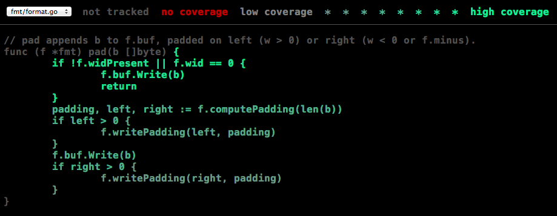

= Kisah tentang perkakas cover
Rob Pike
2 Desember 2013

== Pendahuluan

Sejak awal, Go dirancang untuk memiliki perkakas.
Perkakas tersebut termasuk beberapa teknologi Go yang sangat ikonis seperti
perkakas dokumentasi
https://go.dev/cmd/godoc[godoc^],
perkakas untuk memformat kode
https://go.dev/cmd/gofmt[gofmt^],
dan perkakas untuk membenarkan API
https://go.dev/cmd/fix[gofix^].
Dan yang paling penting dari itu semua adalah
https://go.dev/cmd/go[perintah go^],
program yang otomatis memasang, membangun, dan menguji program Go
menggunakan sumber kode sebagai spesifikasi pembangunan.

Rilis Go 1.2 memperkenalkan sebuah alat baru untuk melaporkan cakupan
(_coverage_) pengujian menggunakan pendekatan yang tidak biasa dalam
menghasilkan statistik pengujian, sebuah pendekatan yang dibangun dari
teknologi yang telah diterapkan pada godoc dan teman-temannya.

== Dukungan untuk perkakas

Pertama, sedikit latar belakang: Apa maksud dari sebuah
https://go.dev/talks/2012/splash.article#TOC_17.[bahasa (pemrograman)
memiliki perkakas yang bagus?^]
Maksudnya adalah bahasa (pemrograman) tersebut membuat kita dapat dengan
mudah membuat alat-alat yang berguna dan ekosistem dari bahasa tersebut
mendukung pembuatan berbagai jenis perkakas.

Ada sejumlah properti yang membuat Go sangat cocok untuk pembuatan perkakas.
Pertama, Go memiliki sintaksis yang gampang di-urai.
Tata bahasa-nya dirancang supaya bebas dari kasus-kasus yang membutuhkan
analisis yang kompleks.

Go menggunakan konstruksi leksikal dan sintaksis supaya properti semantik
gampang dipahami.
Contohnya, penggunaan huruf besar untuk mendefinisikan nama-nama yang
diekspor dan aturan-aturan skop yang secara radikal disederhanakan
dibandingkan dengan bahasa lain dalam keluarga C.

Terakhir, pustaka standar Go memiliki paket-paket dengan kualitas tinggi
untuk memecah dan mengurai sumber kode Go.
Ia juga mengikutkan paket yang dapat mencetak pohon-sintaksis dari kode Go
dengan cantik.

Paket-paket tersebut bila dikombinasikan membentuk inti dari perkakas gofmt,
Secara `gofmt` dapat menerima pohon-sintaksis kode Go dan mengeluarkan kode
yang benar, dengan format yang standar, bisa dibaca manusia, hal ini
menciptakan kemungkinan untuk membuat sebuah perkakas yang mengubah kode
namun tetap benar dan mudah dibaca.

Salah satu contohnya yaitu perkakas gofix, yang mempermudah penulisan ulang
kode menggunakan fitur bahasa yang baru atau untuk memperbarui pustaka.
Gofix membuat kita dapat membuat perubahan fundamental terhadap bahasa dan
pustaka sampai kita merilis
https://go.dev/blog/the-path-to-go-1[Go 1.0],
dengan tingkat kepercayaan yang membuat pengguna dapat menjalankan perkakas
tersebut untuk memperbarui sumber kode mereka menjadi versi yang lebih baru.

Di Google, kita telah menggunakan gofix untuk mengubah sejumlah repositori
kode yang besar dengan cepat, yang tidak bisa dibayangkan pada bahasa
pemrograman lain yang pernah kita gunakan.
Kita tidak perlu lagi mendukung beberapa versi API; kita dapat menggunakan
gofix untuk memperbarui seluruh (kode dalam) perusahaan dengan sekali
operasi.

Tidak hanya perkakas ini saja yang paket-paket tersebut dapat ciptakan.
Mereka juga membuat kita dapat dengan mudah menulis program sederhana
seperti plugin untuk IDE, misalnya.
Semua perkakas tersebut saling membantu satu dengan yang lainnya, membuat
lingkungan Go lebih produktif dengan otomatisasi banyak pekerjaan.

== Cakupan pengujian

Cakupan pengujian yaitu istilah yang menjelaskan tentang berapa banyak
baris kode dalam sebuah paket telah diuji.
Jika mengeksekusi sekumpulan tes menyebabkan 80% dari sumber kode pada paket
tersebut berjalan, kita dapat mengatakan _cakupan pengujian_ adalah 80%.

Program yang menyediakan cakupan pengujian pada Go 1.2 adalah yang paling
baru menggunakan dukungan perkakas dalam ekosistem Go.

Biasanya untuk menghitung cakupan pengujian yaitu dengan mengubah
berkas dari program.
Misalnya, program
http://gcc.gnu.org/onlinedocs/gcc/Gcov.html[gcov^]
dari GNU men-set _breakpoint_ pada cabang-cabang yang dieksekusi oleh
program tersebut.
Saat setiap cabang dieksekusi, _breakpoint_ tersebut kemudian dihapus dan
perintah-perintah pada cabang tersebut ditandai sebagai telah "terjangkau".

Pendekatan ini sangat bagus dan umum digunakan.
Perkakas cakupan pengujian Go awalnya bekerja dengan cara tersebut.
Tapi ada permasalahan.
Ia sangat sulit diimplementasikan, secara analisis dari eksekusi sebuah
program tidaklah gampang.
Ia juga membutuhkan penyambungan eksekusi kembali ke sumber kode, yang mana
bisa saja sangat sulit, seperti yang pernah dialami oleh orang-orang
yang pernah men-_debug_ kode program.
Beberapa permasalahan-nya yaitu tidak akurat-nya informasi _debugging_ dan
isu seperti fungsi-fungsi yang di-_inline_ mempersulit analisis.
Yang lebih penting lagi, pendekatan ini sangat tidak portabel.
Ia harus diimplementasikan untuk setiap arsitektur mesin, dan terkadang
untuk setiap sistem operasi, secara dukungan _debugging_ beragam dari sistem
ke sistem.

Walaupun ia bekerja, misalnya jika Anda pernah menggunakan gccgo, maka
perkakas gcov dapat memberikan Anda informasi tentang cakupan pengujian.
Namun, bila Anda pengguna `gc`, kompilator Go yang paling umum, sampai Go
1.2 Anda belum bisa melihat cakupan pengujian.

== Cakupan pengujian pada Go

Pada perkakas _coverage_ yang baru ini, kita mengambil pendekatan yang
berbeda yang menghindari _debugging_ secara dinamis.
Gagasannya cukup sederhana: Tulis ulang sumber kode sebelum kompilasi untuk
menambahkan instrumentasi, kompilasi kode yang telah berubah tersebut dan
jalankan, kemudian cetak statistik.
Bagian untuk penulisan ulang cukup gampang dibuat secara perintah go
mengontrol alur dari sumber sampai eksekusi.

Berikut contohnya.
Katakanlah kita memiliki paket dengan sebuah berkas seperti ini:
----
package size

func Size(a int) string {
    switch {
    case a < 0:
        return "negative"
    case a == 0:
        return "zero"
    case a < 10:
        return "small"
    case a < 100:
        return "big"
    case a < 1000:
        return "huge"
    }
    return "enormous"
}
----

dan pengujian berikut:
----
package size

import "testing"

type Test struct {
    in  int
    out string
}

var tests = []Test{
    {-1, "negative"},
    {5, "small"},
}

func TestSize(t *testing.T) {
    for i, test := range tests {
        size := Size(test.in)
        if size != test.out {
            t.Errorf("#%d: Size(%d)=%s; want %s", i, test.in, size, test.out)
        }
    }
}
----

Untuk mendapatkan cakupan pengujian dari paket tersebut, kita jalankan
dengan opsi "-cover" pada "go test":
----
% go test -cover
PASS
coverage: 42.9% of statements
ok      size    0.026s
%
----

Perhatikan cakupan pengujian adalah 42.9%, yang mana tidak bagus.
Sebelum kita bertanya bagaimana cara meningkatkan nilai tersebut, mari kita
lihat bagaimana ia dihitung.

Saat _coverage_ dinyalakan, "go test" menjalankan perkakas "cover", sebuah
program terpisah yang termasuk dalam distribusi Go, untuk menulis ulang
sumber kode sebelum kompilasi.
Berikut bentuk dari fungsi `Size` setelah ditulis ulang:
----
func Size(a int) string {
    GoCover.Count[0] = 1
    switch {
    case a < 0:
        GoCover.Count[2] = 1
        return "negative"
    case a == 0:
        GoCover.Count[3] = 1
        return "zero"
    case a < 10:
        GoCover.Count[4] = 1
        return "small"
    case a < 100:
        GoCover.Count[5] = 1
        return "big"
    case a < 1000:
        GoCover.Count[6] = 1
        return "huge"
    }
    GoCover.Count[1] = 1
    return "enormous"
}
----

Setiap bagian yang dapat dieksekusi diberi tanda dengan perintah penempatan
yang, bila dieksekusi, mencatat bahwa bagian tersebut telah dijalankan.
Penghitungan dihubungkan dengan posisi sumber kode asli lewat struktur data
yang juga dihasilkan oleh perkakas _cover_.
Setelah pengujian selesai, penghitungan dikumpulkan dan persentase dihitung
berdasarkan berapa banyak yang telah di-set.

Walaupun anotasi perintah penempatan tampak tidak efisien, ia dikompilasi
menjadi sebuah instruksi "move".
Waktu eksekusi hanya bertambah 3% bila pengujian dijalankan dengan _cover_.
Hal ini membuat cakupan pengujian cukup masuk akal menjadi bagian dari
standar pengembangan.

== Melihat hasil cakupan

Cakupan pengujian dari contoh di atas sangat buruk.
Untuk mengetahui kenapa, kita meminta "go test" menulis "profil cakupan"
untuk kita, sebuah berkas yang menyimpan kumpulan statistik supaya kita
dapat mempelajari lebih detil.
Hal ini cukup mudah dilakukan: gunakan opsi "-coverprofile" dan sebuah
berkas keluaran:

----
% go test -coverprofile=coverage.out
PASS
coverage: 42.9% of statements
ok      size    0.030s
%
----

(Opsi "-coverprofile" otomatis menyalakan opsi "-cover" untuk analisis
cakupan).
Pengujian berjalan secara normal, namun hasilnya sekarang disimpan ke dalam
sebuah berkas.
Untuk membacanya, kita jalankan perkakas cakupan pengujian, tanpa "go test".
Sebagai langkah awal, kita dapat memecah hasil cakupan berdasarkan fungsi,
----
% go tool cover -func=coverage.out
size.go:    Size          42.9%
total:      (statements)  42.9%
%
----

Cara yang lebih menarik lagi untuk melihat data tersebut yaitu dengan
mendapatkan presentasi HTML dari sumber kode yang telah di dekorasi dengan
informasi cakupan pengujian.
Berkas HTML dihasilkan dengan opsi "-html",
----
% go tool cover -html=coverage.out
----

Bila perintah dijalankan, sebuah peramban akan dibuka, memperlihatkan
sumber kode yang telah memiliki cakupan (hijau), yang belum dicakup (merah),
dan yang tidak diperlukan (abu-abu).
Berikut contoh tampilannya:

image::set.png[]

Dengan presentasi HTML ini, terlihat bagian yang salah: kita belum menguji
beberapa kasus!
Dan kita dapat melihat bagian mana, sehingga mudah meningkatkan cakupan
pengujian kita.

== _Heat map_

Kelebihan utama dari pendekatan cakupan pengujian ini yaitu sangat mudah
untuk melakukan instrumentasi kode dengan cara-cara yang berbeda.
Misalnya, kita dapat mengetahui tidak saja apakah sebuah perintah telah
dieksekusi, tapi juga berapa kali.

Perintah "go test" menerima opsi "-covermode" untuk men-set mode cakupan
dengan salah satu dari tiga pengaturan berikut:

* `set`: apakah setiap perintah berjalan?
* `count`: berapa kali perintah dijalankan?
* `atomic`: seperti `count`, namun menghitung secara tepat pada program yang
  paralel.

Pengaturan baku-nya yaitu `set`, seperti yang telah kita lihat.
Pengaturan `atomic` hanya diperlukan bila akurasi penghitungan diperlukan
saat menjalankan algoritma yang paralel.
Ia menggunakan operasi _atomic_ dari paket
https://go.dev/pkg/sync/atomic/[sync/atomic^],
yang bisa jadi tidak efisien.
Pada kebanyakan kasus, mode `count` bekerja dengan baik, seperti mode
`set`, dan sangat efisien.

Mari kita coba menghitung eksekusi perintah untuk paket `fmt` pada pustaka
standar.
Kita jalankan tes dan tulis profil pengujian supaya kita nanti dapat
mengambil informasinya.
----
% go test -covermode=count -coverprofile=count.out fmt
ok      fmt 0.056s  coverage: 91.7% of statements
%
----

Rasio cakupan-nya lebih bagus dari contoh kita sebelumnya.
(Rasio cakupan tidak dipengaruhi oleh mode dari cakupan).
Kita dapat menampilkan cakupan per fungsi:
----
% go tool cover -func=count.out
fmt/format.go: init              100.0%
fmt/format.go: clearflags        100.0%
fmt/format.go: init              100.0%
fmt/format.go: computePadding     84.6%
fmt/format.go: writePadding      100.0%
fmt/format.go: pad               100.0%
...
fmt/scan.go:   advance            96.2%
fmt/scan.go:   doScanf            96.8%
total:         (statements)       91.7%
----

Mari kita lihat keluaran HTML-nya:
----
% go tool cover -html=count.out
----

Berikut presentasi dari fungsi `pad`:

Perhatikan bagaimana intensitas dari warna hijau berubah.
Perintah dengan hijau-cerah memiliki hitungan eksekusi yang tinggi;
hijau yang kurang cerah merepresentasikan hitungan eksekusi yang rendah.
Anda dapat layang kan tetikus pada perintah untuk melihat jumlah
penghitungan yang sebenarnya sebagai _tool tip_.
Pada saat artikel ini ditulis, penghitungan memiliki hasil sebagai
berikut:
----
2933    if !f.widPresent || f.wid == 0 {
2985        f.buf.Write(b)
2985        return
2985    }
  56    padding, left, right := f.computePadding(len(b))
  56    if left > 0 {
  37        f.writePadding(left, padding)
  37    }
  56    f.buf.Write(b)
  56    if right > 0 {
  13        f.writePadding(right, padding)
  13    }
----

Informasi tersebut menampilkan eksekusi fungsi yang cukup banyak,
informasi yang mungkin berguna pada saat _profiling_.

== Blok dasar

Anda mungkin memperhatikan bahwa penghitungan pada contoh sebelumnya tidak
seperti yang Anda inginkan, terutama pada baris dengan kurung-kurawal tutup.
Hal ini karena cakupan pengujian tidak lah pasti.

Apa yang terjadi di sini perlu kita jelaskan.
Kita ingin anotasi cakupan dibatasi oleh cabang-cabang dalam program.
Sangat sulit untuk melakukan hal tersebut dengan cara menulis ulang sumber
kode, secara cabang-cabang tidak muncul secara eksplisit di dalam sumber
kode.

Anotasi cakupan melakukan instrumentasi blok, yang biasanya dibatasi oleh
kurung kurawal.
Cara ini sangat sukar dilakukan supaya tepat.
Konsekuensi yang digunakan algoritma yaitu kurung kurawal tutup seperti
dimiliki oleh blok yang ia tutup, sementara kurung kurawal buka seperti
dimiliki oleh blok di luar-nya.
Konsekuensi menarik lainnya yaitu ekspresi seperti
----
f() && g()
----
instrumentasi-nya tidak memisahkan pemanggilan antara `f` dan `g`.
Walaupun faktanya ia tampak dieksekusi sebanyak jumlah yang sama.

Supaya adil, bahkan `gcov` memiliki masalah di bagian ini.
Perkakas tersebut dapat melakukan instrumentasi dengan benar tapi
presentasi-nya berbentuk baris dan bisa meleset pada beberapa kasus.

== Gambaran besar

Itu lah kisah tentang cakupan pengujian pada Go 1.2.
Perkakas baru dengan implementasi menarik yang membolehkan tidak hanya
statistik cakupan pengujian, namun presentasi yang mudah-di-baca dan bahkan
memungkinkan untuk mengekstrak informasi _profiling_.

Pengujian adalah bagian yang penting dari pengembangan perangkat lunak dan
cakupan pengujian adalah cara paling sederhana untuk digunakan dalam
strategi pengujian Anda.
Cobalah, lakukan pengujian, dan `cover`.
